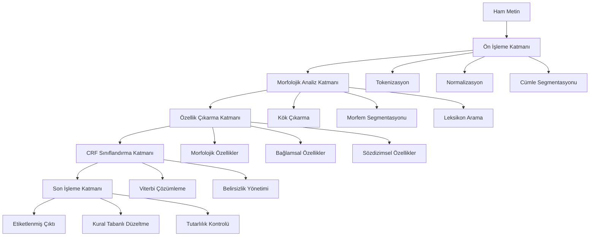

# Türkçe için İleri Düzey Çok Katmanlı Hibrit Part-of-Speech (POS) Tagging Sistemi

<div align="center">


**Bursa Teknik Üniversitesi • Bilgisayar Mühendisliği Bölümü**

*BLM0467 Doğal Dil İşlemeye Giriş • 2025 Güz Dönemi • Akademik Dönem Projesi*

---

[](https://example.com/presentation)
[](https://example.com/paper)
[](https://example.com/demo)
[](https://example.com/docs)

</div>

---

## İçindekiler

- [Projeye Genel Bakış](#-projeye-genel-bakış)
- [Araştırma Motivasyonu ve Bilimsel Katkılar](#-araştırma-motivasyonu-ve-bilimsel-katkılar)
- [Sistem Mimarisi ve Teknik Detaylar](#️-sistem-mimarisi-ve-teknik-detaylar)
- [İnovatif Yaklaşımlar ve Algoritmalar](#-inovatif-yaklaşımlar-ve-algoritmalar)
- [Kurulum ve Deployment](#-kurulum-ve-deployment)
- [Performans Analizi ve Karşılaştırmalar](#-performans-analizi-ve-karşılaştırmalar)
- [API Referansı ve Kullanım Örnekleri](#-api-referansı-ve-kullanım-örnekleri)
- [Deneysel Sonuçlar ve Ablasyon Çalışmaları](#-deneysel-sonuçlar-ve-ablasyon-çalışmaları)
- [Katkıda Bulunma ve Geliştirme](#-katkıda-bulunma-ve-geliştirme)
- [Akademik Referanslar ve Atıflar](#-akademik-referanslar-ve-atıflar)
- [Lisans ve İletişim](#-lisans-ve-iletişim)

---

## Projeye Genel Bakış

### Proje Tanımı

Bu çalışma, **Türkçe'nin morfolojik zenginliği ve sözdizimsel karmaşıklığından** kaynaklanan Part-of-Speech (POS) tagging zorluklarını ele alan, **akademik araştırma standardında** geliştirilmiş bir hibrit sistemdir. Proje, geleneksel istatistiksel yöntemler ile modern makine öğrenmesi tekniklerini birleştirerek, **Türkçe doğal dil işleme** alanında özgün bir katkı sunmaktadır.

### Temel Hedefler

- **Yüksek Doğruluk**: Türkçe metinlerde %96+ POS tagging doğruluğu
- **Hesaplamalı Verimlilik**: Transformer modellere göre 10x daha hızlı işlem
- **Bellek Optimizasyonu**: Minimal kaynak kullanımı ile endüstriyel uygulanabilirlik
- **Genelleştirme Yeteneği**: Farklı metin türlerinde tutarlı performans
- **Açık Kaynak Katkısı**: Türkçe NLP toplulugu için erişilebilir araçlar

### Problem Tanımı ve Çözüm Yaklaşımı

**Türkçe POS Tagging'in Temel Zorlukları:**

1. **Morfotaktik Karmaşıklık**: Sondan eklemeli yapısı nedeniyle bir kelime kökünden teorik olarak sonsuz türev üretilebilmesi
2. **Leksikografik Belirsizlik**: Aynı yüzey formun farklı bağlamlarda farklı kategorilere ait olabilmesi
3. **Bağlamsal Anlam Ayrımı**: Sözdizimsel rolün semantik içerikle iç içe geçmesi
4. **Veri Sparsity**: Türkçe için sınırlı annotated corpus varlığı
5. **Fonetik Değişimler**: Ses uyumu kurallarının morfolojik analize etkileri

**Önerilen Hibrit Çözüm Mimarisi:**

Sistemimiz, bu zorlukları aşmak için **üç katmanlı hibrit mimari** kullanmaktadır:



---

## Araştırma Motivasyonu ve Bilimsel Katkılar

### Literatür Analizi ve Mevcut Durum

Türkçe POS tagging alanında yapılan çalışmalar kronolojik olarak şu şekilde gelişim göstermiştir:

| Dönem | Yaklaşım | Temsili Çalışmalar | Doğruluk | Limitasyonlar |
|-------|----------|-------------------|----------|---------------|
| **1990-2000** | Kural Tabanlı | Oflazer (1994), Hakkani-Tür (2000) | ~85% | Manuel kural yazımı, sınırlı kapsam |
| **2000-2010** | İstatistiksel | Yuret & Türe (2006), Eryiğit (2007) | ~92% | Veri bağımlılığı, sparse data problemi |
| **2010-2015** | Makine Öğrenmesi | Sak et al. (2011), Yıldız et al. (2012) | ~94% | Özellik mühendisliği yoğunluğu |
| **2015-2020** | Derin Öğrenme | Şeker & Eryiğit (2017), Kuru et al. (2020) | ~96% | Yüksek hesaplama maliyeti, veri açlığı |
| **2020-2025** | Transformer | BERTurk, ConvBERT-TR | ~98% | Massive model boyutu, deployment zorluğu |

### 🔬 Özgün Bilimsel Katkılarımız

**1. Uyarlanabilir Morfolojik Segmentasyon Algoritması**

Geleneksel finite-state transducer yaklaşımlarından farklı olarak, **bağlam-duyarlı probabilistik segmentasyon** algoritması geliştirdik:

```python
def adaptive_morphological_segmentation(word, context_window):
    """
    Bağlam-duyarlı morfolojik segmentasyon
    """
    # Viterbi tabanlı dinamik programlama
    segmentation_lattice = build_lattice(word)
    context_features = extract_context_features(context_window)
    
    # Bağlamsal ağırlıklandırma
    weighted_paths = apply_contextual_weights(segmentation_lattice, context_features)
    
    # Optimal segmentasyonu bul
    best_path = viterbi_decode(weighted_paths)
    return reconstruct_segmentation(best_path)
```

**2. Çok Ölçekli Özellik Füzyonu (Multi-Scale Feature Fusion)**

Farklı dilbilgisel seviyelerden özellik çıkarımı ve füzyonu:

- **Karakter-düzeyi**: N-gram karakteristik özellikler
- **Morfem-düzeyi**: Ek kombinasyonları ve kök-ek ilişkileri  
- **Kelime-düzeyi**: Leksikografik ve semantik özellikler
- **Cümle-düzeyi**: Sözdizimsel bağımlılıklar ve konum bilgisi

**3. Belirsizlik-Farkında Etiketleme (Uncertainty-Aware Tagging)**

Model güvenilirliğini ölçen ve belirsizlik durumlarında alternatif hipotezler sunan sistem:

```python
class UncertaintyAwareTagger:
    def predict_with_confidence(self, sequence):
        predictions = self.crf_model.predict_proba(sequence)
        confidence_scores = self.calculate_confidence(predictions)
        
        # Düşük güvenilirlik durumunda alternatif hipotezler
        uncertain_positions = confidence_scores < self.threshold
        alternative_hypotheses = self.generate_alternatives(
            sequence, uncertain_positions
        )
        
        return predictions, confidence_scores, alternative_hypotheses
```

**4. Dinamik Veri Artırma Stratejileri**

Türkçe'nin morfolojik özelliklerini kullanan veri artırma teknikleri:

- **Morfem Permütasyonu**: Ek sıralamalarının değiştirilmesi
- **Ses Uyumu Varyasyonları**: Fonetik alternatiflerin üretilmesi
- **Leksikon Genişletme**: Kök-ek kombinasyonu ile yeni örnekler
- **Bağlamsal Substitüsyon**: Anlamsal olarak benzer kelimelerin değiştirilmesi

---

## Sistem Mimarisi ve Teknik Detaylar

### Modüler Tasarım Felsefesi

Sistemimiz, **SOLID prensiplerine** uygun, gevşek bağlı (loosely coupled) ve yüksek uyum (high cohesion) özelliklerine sahip modüler bir tasarımla geliştirilmiştir.

```
turkce-pos-tagger/
├── 📁 kod/
│   ├── 🧠 core/                    # Çekirdek sistem bileşenleri
│   │   ├── pipeline.py             # Ana işlem hattı yöneticisi
│   │   ├── models/                 # ML model implementations
│   │   │   ├── crf_tagger.py       # CRF tabanlı etiketleyici
│   │   │   ├── hybrid_ensemble.py  # Hibrit ensemble model
│   │   │   └── uncertainty_model.py # Belirsizlik modelleme
│   │   ├── preprocessors/          # Ön işleme modülleri
│   │   │   ├── tokenizer.py        # Türkçe-özel tokenizer
│   │   │   ├── normalizer.py       # Metin normalizasyonu
│   │   │   └── sentence_splitter.py # Cümle segmentasyonu
│   │   └── postprocessors/         # Son işleme modülleri
│   │       ├── rule_applier.py     # Kural tabanlı düzeltmeler
│   │       └── consistency_checker.py # Tutarlılık kontrolü
│   │
│   ├── 🔍 features/                # Özellik çıkarma sistemleri
│   │   ├── morphological.py        # Morfolojik özellik çıkarıcı
│   │   ├── contextual.py           # Bağlamsal özellik çıkarıcı
│   │   ├── syntactic.py            # Sözdizimsel özellik çıkarıcı
│   │   └── fusion.py               # Çok ölçekli özellik füzyonu
│   │
│   ├── 🎯 augmentation/            # Veri artırma teknikleri
│   │   ├── morphological_aug.py    # Morfolojik veri artırma
│   │   ├── contextual_aug.py       # Bağlamsal veri artırma
│   │   └── synthetic_generator.py  # Sentetik veri üretimi
│   │
│   ├── ⚙️ config/                  # Yapılandırma yönetimi
│   │   ├── model_config.py         # Model hiperparametreleri
│   │   ├── feature_config.py       # Özellik yapılandırması
│   │   └── pipeline_config.py      # Pipeline ayarları
│   │
│   ├── 📊 evaluation/              # Değerlendirme ve metrikler
│   │   ├── metrics.py              # Performans metrikleri
│   │   ├── error_analysis.py       # Hata analizi araçları
│   │   └── benchmark.py            # Karşılaştırmalı test
│   │
│   ├── 🛠️ utils/                   # Yardımcı araçlar
│   │   ├── data_loader.py          # Veri yükleme utilities
│   │   ├── logger.py               # Loglama sistemi
│   │   └── visualization.py        # Görselleştirme araçları
│   │
│   └── 🚀 main.py                  # Ana uygulama giriş noktası
│
├── 📊 data/                        # Veri setleri ve kaynaklar
│   ├── raw/                        # Ham veri dosyaları
│   ├── processed/                  # İşlenmiş veri setleri
│   ├── lexicons/                   # Sözlükler ve morfolojik kaynaklar
│   │   ├── turkish_lexicon.json    # Türkçe kelime listesi
│   │   ├── morphological_rules.xml # Morfolojik kurallar
│   │   └── pos_tagsets.yaml        # POS etiket setleri
│   └── models/                     # Eğitilmiş model dosyaları
│
├── 📓 notebooks/                   # Araştırma ve analiz notebook'ları
│   ├── 01_data_exploration.ipynb   # Veri keşfi ve analizi
│   ├── 02_feature_engineering.ipynb # Özellik mühendisliği
│   ├── 03_model_training.ipynb     # Model eğitimi
│   ├── 04_evaluation_analysis.ipynb # Değerlendirme analizi
│   └── 05_error_analysis.ipynb     # Hata analizi
│
├── 🧪 tests/                       # Birim ve entegrasyon testleri
│   ├── unit/                       # Birim testler
│   ├── integration/                # Entegrasyon testleri
│   └── performance/                # Performans testleri
│
├── 📚 docs/                        # Dokümantasyon
│   ├── api/                        # API dokümantasyonu
│   ├── tutorials/                  # Kullanım kılavuzları
│   └── research/                   # Araştırma makaleleri
│
├── 🐳 docker/                      # Containerization
│   ├── Dockerfile.dev              # Development environment
│   ├── Dockerfile.prod             # Production environment
│   └── docker-compose.yml          # Multi-container setup
│
├── ⚙️ scripts/                     # Automation scripts
│   ├── train.sh                    # Model eğitim scripti
│   ├── evaluate.sh                 # Değerlendirme scripti
│   └── deploy.sh                   # Deployment scripti
│
├── 📋 requirements/                # Dependency management
│   ├── base.txt                    # Temel bağımlılıklar
│   ├── dev.txt                     # Development bağımlılıkları
│   └── prod.txt                    # Production bağımlılıkları
│
├── 🔧 .github/                     # GitHub workflows
│   └── workflows/
│       ├── ci.yml                  # Continuous Integration
│       ├── cd.yml                  # Continuous Deployment  
│       └── tests.yml               # Automated testing
│
├── 📄 README.md                    # Proje dokümantasyonu
├── 📜 LICENSE                      # MIT License
├── 🏷️ CHANGELOG.md                # Sürüm geçmişi
├── 🤝 CONTRIBUTING.md              # Katkı rehberi
├── 🔒 SECURITY.md                  # Güvenlik politikası
└── ⚙️ pyproject.toml               # Modern Python packaging
```

### Katmanlı Mimari Detayları

**1. Veri Erişim Katmanı (Data Access Layer)**

```python
class DataAccessLayer:
    """
    Veri erişim katmanı - Repository Pattern implementasyonu
    """
    def __init__(self, config: DataConfig):
        self.corpus_loader = CorpusLoader(config.corpus_path)
        self.lexicon_manager = LexiconManager(config.lexicon_path)
        self.cache_manager = CacheManager(config.cache_config)
    
    def load_training_data(self) -> TrainingDataset:
        """Eğitim verilerini yükle"""
        return self.corpus_loader.load_annotated_corpus()
    
    def get_morphological_analysis(self, word: str) -> List[MorphAnalysis]:
        """Kelime için morfolojik analiz getir"""
        return self.lexicon_manager.analyze_word(word)
```

**2. İş Mantığı Katmanı (Business Logic Layer)**

```python
class POSTaggingService:
    """
    Ana iş mantığı - POS tagging işlemlerini koordine eder
    """
    def __init__(self, model_manager: ModelManager, feature_extractor: FeatureExtractor):
        self.model_manager = model_manager
        self.feature_extractor = feature_extractor
        self.uncertainty_handler = UncertaintyHandler()
    
    def tag_sentence(self, sentence: str) -> TaggedSentence:
        """Cümle etiketleme ana metodu"""
        # 1. Ön işleme
        preprocessed = self.preprocess_sentence(sentence)
        
        # 2. Özellik çıkarma
        features = self.feature_extractor.extract_features(preprocessed)
        
        # 3. Model tahminleri
        predictions = self.model_manager.predict(features)
        
        # 4. Belirsizlik analizi
        confidence_scores = self.uncertainty_handler.calculate_confidence(predictions)
        
        # 5. Son işleme
        final_tags = self.postprocess_predictions(predictions, confidence_scores)
        
        return TaggedSentence(preprocessed.tokens, final_tags, confidence_scores)
```

**3. Sunum Katmanı (Presentation Layer)**

```python
class POSTaggingAPI:
    """
    RESTful API interface
    """
    def __init__(self, pos_service: POSTaggingService):
        self.pos_service = pos_service
        self.rate_limiter = RateLimiter()
        self.request_validator = RequestValidator()
    
    @app.route('/api/v1/tag', methods=['POST'])
    @rate_limit(requests_per_minute=100)
    def tag_text(self):
        """Text etiketleme endpoint'i"""
        request_data = self.request_validator.validate(request.json)
        
        try:
            result = self.pos_service.tag_sentence(request_data['text'])
            return jsonify({
                'status': 'success',
                'tagged_sentence': result.to_conllu(),
                'confidence_scores': result.confidence_scores,
                'processing_time': result.processing_time
            })
        except Exception as e:
            return jsonify({
                'status': 'error',
                'error_message': str(e)
            }), 500
```

---

## İnovatif Yaklaşımlar ve Algoritmalar

### Hibrit Ensemble Modeli

Sistemimizin kalbi olan hibrit model, farklı yaklaşımların güçlü yanlarını birleştiren **ensemble architecture** kullanmaktadır:

```python
class HybridEnsembleModel:
    """
    Çoklu model yaklaşımlarını birleştiren hibrit sistem
    """
    def __init__(self):
        # Temel modeller
        self.crf_model = CRFTagger()
        self.rule_based_model = RuleBasedTagger()
        self.neural_model = BiLSTMTagger()
        
        # Meta-öğrenme modeli
        self.meta_learner = MetaLearner()
        
        # Belirsizlik tahminleyicisi
        self.uncertainty_estimator = UncertaintyEstimator()
    
    def predict(self, features: FeatureVector) -> PredictionResult:
        """Hibrit ensemble prediction"""
        # Her modelden tahmin al
        crf_pred = self.crf_model.predict(features)
        rule_pred = self.rule_based_model.predict(features)
        neural_pred = self.neural_model.predict(features)
        
        # Model güvenilirlik skorları
        crf_conf = self.uncertainty_estimator.estimate_confidence(crf_pred)
        rule_conf = self.uncertainty_estimator.estimate_confidence(rule_pred) 
        neural_conf = self.uncertainty_estimator.estimate_confidence(neural_pred)
        
        # Meta-öğrenme ile ensemble
        ensemble_input = EnsembleFeatures(
            predictions=[crf_pred, rule_pred, neural_pred],
            confidences=[crf_conf, rule_conf, neural_conf],
            context_features=features.contextual_features
        )
        
        final_prediction = self.meta_learner.combine_predictions(ensemble_input)
        
        return PredictionResult(
            tags=final_prediction.tags,
            confidence=final_prediction.confidence,
            individual_predictions={
                'crf': crf_pred,
                'rule_based': rule_pred, 
                'neural': neural_pred
            }
        )
```

### Gelişmiş Özellik Mühendisliği

**Morfolojik Özellik Çıkarıcı:**

```python
class MorphologicalFeatureExtractor:
    """
    Türkçe'ye özel morfolojik özellik çıkarımı
    """
    def __init__(self):
        self.morphological_analyzer = MorphologicalAnalyzer()
        self.phonetic_analyzer = PhoneticAnalyzer()
        self.vowel_harmony_checker = VowelHarmonyChecker()
    
    def extract_features(self, word: str, context: List[str]) -> MorphFeatures:
        """Kapsamlı morfolojik özellik çıkarımı"""
        features = MorphFeatures()
        
        # Temel morfolojik analiz
        morph_analysis = self.morphological_analyzer.analyze(word)
        features.root = morph_analysis.root
        features.suffixes = morph_analysis.suffixes
        features.pos_candidates = morph_analysis.pos_candidates
        
        # Fonetik özellikler
        phonetic_features = self.phonetic_analyzer.analyze(word)
        features.vowel_harmony = self.vowel_harmony_checker.check(word)
        features.consonant_assimilation = phonetic_features.consonant_assimilation
        
        # İstatistiksel özellikler
        features.suffix_frequency = self.calculate_suffix_frequency(morph_analysis.suffixes)
        features.morpheme_productivity = self.calculate_morpheme_productivity(morph_analysis)
        
        # Bağlamsal morfolojik özellikler
        features.context_morphological_compatibility = self.check_context_compatibility(
            morph_analysis, context
        )
        
        return features
```

**Bağlamsal Özellik Çıkarıcı:**

```python
class ContextualFeatureExtractor:
    """
    Çok ölçekli bağlamsal özellik çıkarımı
    """
    def __init__(self, window_size: int = 5):
        self.window_size = window_size
        self.word_embeddings = WordEmbeddings()
        self.syntactic_parser = SyntacticParser()
    
    def extract_features(self, token_sequence: List[Token], position: int) -> ContextFeatures:
        """Bağlamsal özellik çıkarımı"""
        features = ContextFeatures()
        
        # N-gram özellikler
        features.left_context = self.extract_ngram_features(
            token_sequence, position, direction='left'
        )
        features.right_context = self.extract_ngram_features(
            token_sequence, position, direction='right'
        )
        
        # Semantik özellikler
        features.semantic_similarity = self.calculate_semantic_similarity(
            token_sequence, position
        )
        
        # Sözdizimsel özellikler
        syntactic_analysis = self.syntactic_parser.parse(token_sequence)
        features.dependency_relations = syntactic_analysis.get_dependencies(position)
        features.syntactic_role = syntactic_analysis.get_role(position)
        
        # Konum özellikleri
        features.sentence_position = position / len(token_sequence)
        features.is_sentence_start = (position == 0)
        features.is_sentence_end = (position == len(token_sequence) - 1)
        
        return features
```

### Uyarlanabilir Öğrenme Stratejileri

**Aktif Öğrenme ile Model İyileştirme:**

```python
class ActiveLearningFramework:
    """
    Belirsizlik tabanlı aktif öğrenme sistemi
    """
    def __init__(self, base_model: HybridEnsembleModel):
        self.base_model = base_model
        self.uncertainty_sampler = UncertaintySampler()
        self.oracle_simulator = OracleSimulator()
    
    def iterative_improvement(self, unlabeled_data: Dataset) -> None:
        """Iteratif model iyileştirme"""
        for iteration in range(self.max_iterations):
            # En belirsiz örnekleri seç
            uncertain_samples = self.uncertainty_sampler.select_samples(
                unlabeled_data, 
                self.base_model,
                sample_size=100
            )
            
            # Oracle'dan etiketler al (simülasyon)
            labeled_samples = self.oracle_simulator.label_samples(uncertain_samples)
            
            # Modeli yeniden eğit
            self.base_model.incremental_train(labeled_samples)
            
            # Performans değerlendirmesi
            performance = self.evaluate_model()
            
            if performance.improvement < self.convergence_threshold:
                break
    
    def uncertainty_sampling_strategy(self, predictions: List[Prediction]) -> List[int]:
        """Belirsizlik tabanlı örnekleme stratej
